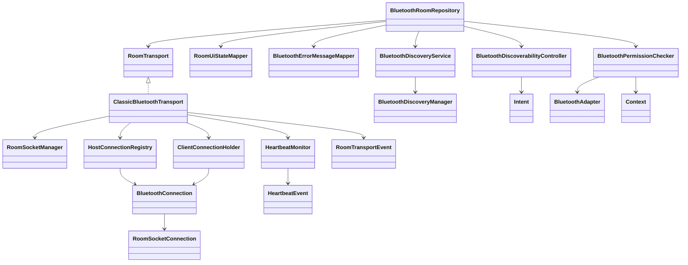

# 蓝牙结构说明

本文档用于蓝牙结构最终复盘和后续 UML 绘制准备。当前目标是说明已有结构边界，不引入新的协议层、领域层或会话层。

## 当前包结构

- `com.example.chudadi.network.room`
  - `BluetoothRoomRepository`：蓝牙房间编排入口，连接 UI 状态、房间成员/座位/对局协调器和蓝牙传输边界。
  - `RoomSocketManager`：底层 RFCOMM socket 创建、accept、connect、读循环生命周期管理。
  - `BluetoothDiscoveryManager`：Android 蓝牙扫描实现，当前由 `BluetoothDiscoveryService` 包装。
- `com.example.chudadi.network.room.presentation`
  - `RoomUiStateMapper`：把房间权威状态和蓝牙展示输入映射为 `RoomUiState`。
  - `BluetoothErrorMessageMapper`：把蓝牙异常映射为用户可读文案。
- `com.example.chudadi.network.bluetooth.platform`
  - `BluetoothPermissionChecker`：蓝牙支持情况和运行时权限检查。
  - `BluetoothDiscoveryService`：扫描附近设备、加载已配对设备、维护发现设备状态。
  - `BluetoothDiscoverabilityController`：创建“本机可被发现”的 Android Intent。
- `com.example.chudadi.network.bluetooth.transport`
  - `RoomTransport`：Repository 依赖的蓝牙房间传输边界。
  - `RoomTransportEvent`：传输层事件。
  - `HostTransportConfig`：启动房主监听需要的传输参数。
  - `ClassicBluetoothTransport`：Classic Bluetooth/RFCOMM 的 `RoomTransport` 实现。
  - `HostConnectionRegistry`：房主侧 participantId 到连接的注册表。
  - `ClientConnectionHolder`：客户端侧唯一房主连接持有者。
  - `BluetoothConnection`：单条蓝牙连接的读、写、关闭包装。
  - `HeartbeatMonitor`：心跳循环、心跳时间戳和心跳超时事件。

## 职责边界

`BluetoothRoomRepository` 仍是房间编排类，但不直接操作 socket。它依赖 `RoomTransport` 发送消息、启动监听、连接房主和接收传输事件；依赖 `BluetoothPermissionChecker` 处理权限；依赖 `BluetoothDiscoveryService` 处理扫描；依赖 `BluetoothDiscoverabilityController` 处理本机可发现性；依赖 `RoomUiStateMapper` 和 `BluetoothErrorMessageMapper` 处理 UI 状态和文案。

`ClassicBluetoothTransport` 是传输协调者。它组合 `RoomSocketManager`、`HostConnectionRegistry`、`ClientConnectionHolder` 和 `HeartbeatMonitor`，把 socket 事件转换为 `RoomTransportEvent`。它不处理 UI、成员、座位、准备、重连身份恢复或游戏规则。

`RoomSocketManager` 只保留底层 socket accept/connect、读循环和关闭生命周期。它仍通过 actor loop 连接 registry、holder 和 heartbeat，这是当前兼容债；不要把成员规则、座位规则、UI 文案或游戏规则放回这里。

`HostConnectionRegistry` 只维护房主侧连接表。`ClientConnectionHolder` 只维护客户端到房主的一条连接。`BluetoothConnection` 只封装单连接读写关闭。`HeartbeatMonitor` 只负责心跳发送节奏、心跳时间戳和超时事件。

## 语义约定

- `startHostListening` / `startHostTransportListening`：启动房主监听，接受房间连接。
- `discovery` / `startDiscovery`：扫描附近蓝牙设备或可加入房间。
- `discoverable`：请求 Android 让本机可被其他设备发现。
- `broadcast`：只表示向多个已连接 participant 发送同一条消息。
- `heartbeat`：只表示传输心跳，不表示重连身份恢复或成员恢复。
- `registry`：房主侧多连接注册表。
- `holder`：客户端侧单连接持有者。
- `connection`：单条蓝牙 socket 连接包装。
- `monitor`：心跳状态和超时监视。

## 兼容债

- `RoomTransport` 仍暴露 `RoomSocketConnection`，因为当前加入房间握手仍由房间成员代码完成。
- `attachHostReadLoop`、`attachClientReadLoop`、`replaceHostConnection` 是兼容入口，后续如果重做传输/会话边界，可以再收口。
- `RoomSocketManager` 仍负责读循环 job 与 registry/holder/heartbeat 的 actor loop 串联，原因是当前需要保持既有断线、心跳和重连入口行为不变。
- `BluetoothConnection` 的写入路径暂未做显式串行化。业务消息和心跳可能从不同协程写入同一连接，当前已在 KDoc 中记录并发写风险，后续应优先在连接层统一串行化。

## 不应修改的边界

- 不在蓝牙传输层处理成员、座位、准备、重连身份恢复、游戏规则或 UI 文案。
- 不把 `broadcast` 用作“启动监听”或“设备可发现”的命名。
- 不在 `HeartbeatMonitor` 中加入重连、成员恢复或 UI 行为。
- 不在 `BluetoothPermissionChecker` 之外散落 Android 蓝牙权限策略。
- 不在 `BluetoothDiscoveryService` 之外扩散扫描状态管理。
- 不在 `BluetoothDiscoverabilityController` 之外创建可发现性 Intent。

## UML 绘制建议

建议先画蓝牙结构类图，再补充事件流。类图关系可按下列方向绘制：

事件流建议单独画：

1. 房主创建房间：`BluetoothRoomRepository -> RoomTransport.startHost -> ClassicBluetoothTransport -> RoomSocketManager.startServerSynchronously`。
2. 客户端加入房间：`BluetoothRoomRepository -> RoomTransport.connectToHost -> ClassicBluetoothTransport -> RoomSocketManager.connectToHost`，握手完成后再 `attachClientReadLoop`。
3. 房主接收连接：`RoomSocketManager -> RoomTransportEvent.IncomingConnection -> BluetoothRoomRepository -> RoomMembershipCoordinator`，成员校验后再 `attachHostReadLoop`。
4. 消息广播：`BluetoothRoomRepository.broadcastSnapshot -> RoomTransport.broadcast -> HostConnectionRegistry.broadcastTargets -> BluetoothConnection.sendSafely`。
5. 心跳：`ClassicBluetoothTransport.launchHostHeartbeat -> HeartbeatMonitor`，超时后通过 `HeartbeatEvent` 转换为断线事件。

## 复盘结论

当前蓝牙结构已经适合绘制 UML。`BluetoothRoomRepository` 和 `RoomSocketManager` 仍偏大，但职责边界已经通过传输、平台、连接表、连接持有者和心跳组件拆开；本轮不继续拆分，避免引入新的协议层、领域层或会话层。
